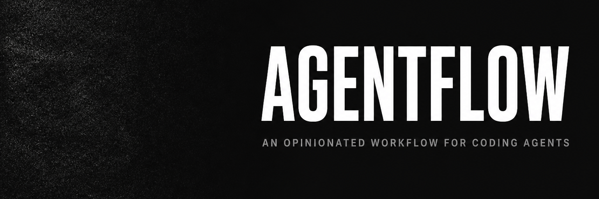

<p align="left">
  <a href="https://www.npmjs.com/package/@reforma/agentflow"></a>
  <a href="LICENSE"></a>
  <a href="https://www.skills.sh/reforma-dev/agentflow"></a>
</p>

<p align="center">
  
</p>

```text
Research → Grill → Plan → PR → Review → Commit
                          ↑                │
                          └──── Repeat ────┘
```

```bash
npx @reforma/agentflow init
```

# AgentFlow

An opinionated workflow for shipping production-ready changes with coding agents. Research when needed, grill decisions, plan PR-sized slices, then implement and review each slice one by one.

### Why

A single open-ended prompt works for a tiny change. On larger work, scope expands, decisions disappear into chat history, and the model fills the gaps with guesses — skipping edge cases, weakening validation, or choosing the wrong abstraction. Start a new chat, and all the reasoning is gone.

Spec-driven frameworks such as OpenSpec and Spec Kit address this by moving intent into documents — proposals, requirements, designs, and task trees — then driving the agent from them. The idea is sound, but the cost is real: commands to learn, many artifacts before code starts, poor fit for small fixes, and enough friction to push people back to unstructured chat when the ceremony outweighs the task.

AgentFlow is what survived half a year of shipping real PRs with agents:

- **Specs ≠ shipped code.** Research and plans are working artifacts first. Commit them and keep using them as specs, leave them local, or delete them after the PR — AgentFlow does not prescribe their lifetime. Git and PRs remain the center of the workflow.
- **Ceremony is a tax.** Spec-driven workflows only work when every developer learns and follows the process. Eventually someone bypasses it, and stale artifacts start misleading future agents. With AgentFlow, you start by clarifying the task and the agent carries the workflow from there.
- **Discipline lives in the loop.** Decisions are settled before implementation, work is limited to one PR-sized slice, and that slice is reviewed before the next begins. You can skip steps that do not help, but the order stays the same.

| Skill          | What it does                                                               |
| -------------- | -------------------------------------------------------------------------- |
| `/research`    | Save research for the current or a later chat                              |
| `/grill`       | Question an idea until the important decisions are clear                   |
| `/plan`        | Split the work into PR-sized slices                                        |
| `/code-review` | Review the slice: reuse, leftover structure, and obvious defects           |
| `/handoff`     | Pass context when you want to continue the work in another chat            |
| `/tdd`         | Work through one red-green slice at a time                                 |

---

## 🔄 The Loop

Research helps when the agent does not know the area, and most larger tasks also need a plan. But almost every task goes through Grill. Small, obvious changes can go straight from Grill to implementation.

1. Learn how it works (optional)
2. Sharpen the idea with Grill
3. Slice the work into PRs
4. Implement one PR
5. Agent review
6. Your review, then commit
7. Refresh the context when needed or start the new chat

Repeat steps 4–7 until every PR in the plan is complete.

> [!TIP]
> AgentFlow keeps research, plans, handoffs, and local setup state under `.agentflow/`.
> Version control is your choice: ignore the directory for a
> private workflow, or commit it to share the work with your team like an OpenSpec workspace.

### 🔍 Step 1. Learn how it works (optional)

Research does not require a skill. Even a simple prompt like "Find out how
authentication works in this project" can make the implementation much easier.

This step is optional, but highly recommended when the agent has not worked in
the area before. It lets the agent understand what it will be changing before
the implementation starts.

Use `/research` when the findings should survive the current chat. It saves the
research artifacts under `.agentflow/<feature>/research/`, ready to attach after
context compaction or in a new chat.

Even if you skip this step, Grill will fill in any gaps.

### 🔥 Step 2. Sharpen the idea with Grill

Grill is the core of AgentFlow and the one step used for the most tasks.

Run `/grill` after research, or start with it when research is not needed.

The agent explains how it understands the task, surfaces assumptions and
decision points, and recommends an answer for each one. You confirm or correct
that understanding. If your answers open new questions, the agent continues
until nothing important is left unclear.

Now the agent does not have to fill in the gaps while coding.

### 🗂️ Step 3. Plan and slice the work into PRs

For a larger task, planning follows Grill in the same chat. After you confirm
the reading, Grill loads `/plan` when the work needs more than one slice.
Small confirmed work skips the plan and goes to implementation. You can also
run `/plan` yourself.

In a normal chat, `/plan` saves the result to `.agentflow/<slug>/plan.md`. In
Native Plan mode, the agent uses its built-in planning flow and native plan
artifact instead.

The plan breaks the feature into PRs that can be shipped one by one. A PR is the
smallest complete change that does one useful thing and has a clear way to check
it, not a fixed number of files or lines.

Larger work usually starts with lower-level pieces and moves to the code that
uses them. A full-stack feature might start with behavior-preserving
refactoring, continue with shared types and backend work, and finish with the
frontend. A frontend feature might move from reusable components, through
shared runtime or wiring, to the user-facing interface.

These are examples, not a required template. A small feature stays as one
vertical slice. Feature-local components and wiring stay with the interface
that first uses them instead of becoming placeholder PRs.

Keep the plan updated as the work changes.

### 🛠️ Step 4. Implement one PR

Implement the first unchecked PR and nothing beyond it. Without a plan, keep the
change small enough to review. You can stay in the current chat, start a fresh
one, or write the code yourself. Bring the plan and latest handoff when moving
to another chat. Use `/tdd` for test-first work.

Load any relevant skills named in `AGENTS.md`. If work spills into a later PR,
update the plan instead of silently expanding the current one.

Before review, update `plan.md`: check the completed PR only after its checks
pass, then apply any scope changes to later rows.

### 🤖 Step 5. Agent review

Run `/code-review` on the completed PR. It checks reuse, leftover structure,
and obvious defects. Local fixes land without asking. Anything left unfixed
comes back as a problem heading plus the change it would make.

### ✅ Step 6. Your review, then commit

Read the diff yourself, then commit it using the project's normal workflow.

### 🔄 Step 7. Refresh the context when needed

Keep the current chat if it still has useful context. When it gets noisy,
summarize it or start a fresh one. Run `/handoff` to save what shipped, what
changed, and which PR comes next.

Attach the plan and handoff to a fresh chat when they exist, then return to step 4.

## 📦 Install

```bash
npx @reforma/agentflow init
```

Init installs every AgentFlow skill through the `skills` CLI first. That CLI
asks for target agents, project or global scope, and the installation method.
After skills finish, AgentFlow asks whether to set up docs. Yes writes
`AGENTFLOW.md` and adds this pointer to `AGENTS.md`:

```text
Larger than a quick fix: follow @AGENTFLOW.md.
```

Update the installed workflow:

```bash
npx @reforma/agentflow@latest update
```

Updates are non-interactive after setup and refresh only the parts selected
during initialization. Without AgentFlow, `update` starts the same setup as
`init`.

Do not edit `AGENTFLOW.md`. `init` and `update` will replace it.

<details>
<summary>More install options</summary>

Known destination:

```bash
npx @reforma/agentflow init --global --agent cursor
```

Automation without prompts:

```bash
npx @reforma/agentflow init --yes
```

One skill without the workflow:

```bash
npx skills add reforma-dev/agentflow --skill grill
```

</details>

---

## ⚖️ How we compare

OpenSpec and Spec Kit try to cover most of spec-driven development with their
own commands, templates, and artifacts. AgentFlow does not try to be an
all-in-one system. It adds a small, opinionated loop to the way you already
build software.

**vs. [OpenSpec](https://github.com/Fission-AI/OpenSpec)** — OpenSpec manages
proposals, requirements, designs, tasks, and completed changes when specs are
the center of the process. AgentFlow stays on one plan and a handoff only when
context moves — no spec tree to adopt.

**vs. [Spec Kit](https://github.com/github/spec-kit)** — Spec Kit is a full
phase-based process (constitution, specs, plans, tasks). AgentFlow gives an
order of work without moving the rest of your development process into the
framework.

**vs. an unstructured chat** — Fine for a small fix. On larger changes,
AgentFlow keeps decisions out of chat history, limits scope to one reviewable
slice, and gives the next session enough context to continue.

## 🚀 Releasing

Add a changeset with every publishable change:

```bash
bun run changeset
```

When that changeset reaches `main`, the publish workflow tests the package,
updates its version and changelog, publishes it to npm through trusted
publishing, and commits the release files back to `main`. A separate job then
publishes the matching versioned Agent Skills release on GitHub.

Validate a release locally without publishing:

```bash
gh skill publish --dry-run
bun run test
bun publish --dry-run
```

## 📖 License

AgentFlow is available under the [MIT License](LICENSE).

## 👤 Maintainer


Maintained with ❤️ by [@kachurun](https://github.com/kachurun)
